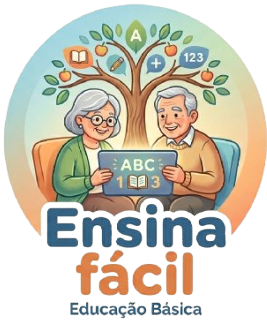

# 📘 Ensina Fácil – Protótipo Educacional

---

## 📌 Sobre o Projeto

O **Ensina Fácil** é um protótipo de aplicativo educacional desenvolvido para facilitar o aprendizado de **educação básica**, com foco especial em **idosos e pessoas com baixa familiaridade com tecnologia**.

O projeto busca criar uma interface simples, intuitiva e acessível, permitindo que o usuário aprenda de forma leve, visual e organizada.

---

## 🎯 Objetivo

- Tornar o aprendizado mais acessível para idosos  
- Criar uma interface simples e fácil de navegar  
- Praticar desenvolvimento front-end (HTML e CSS)  
- Desenvolver noções de UI/UX para acessibilidade  
- Simular um aplicativo educacional funcional  

---

## 🧠 Ideia do Projeto

O app simula uma plataforma de ensino com:

- 📚 Módulos de aprendizado  
- 📖 Aulas simples e organizadas  
- ⭐ Avaliações interativas  
- 🏆 Sistema de conquistas (gamificação)  
- 💬 Área de mensagens (futuro)  
- 👤 Perfil do usuário (futuro)  

---

## 🛠️ Tecnologias Utilizadas

- HTML5  
- CSS3  
- JavaScript (básico para interação de telas)

---

## ♿ Foco em Acessibilidade

O projeto foi pensado para facilitar o uso por idosos:

- Botões grandes e visíveis  
- Cores contrastantes  
- Navegação simples  
- Textos claros e objetivos  
- Interface estilo “app de celular”  

---

## 👥 Integrantes

Projeto desenvolvido em grupo como atividade escolar.

- João Pedro Magri Martins | GitHub: Jpmagri-07  
- ***** ***** | GitHub: ********  

---

## 🚧 Status do Projeto

⚠️ Protótipo em desenvolvimento

- Interface inicial concluída  
- Funcionalidades ainda em expansão  
- Sem backend ou banco de dados  

---

## 📷 Preview do Projeto

  

---

## 📌 Finalidade

Este projeto tem caráter exclusivamente educacional, com o objetivo de praticar desenvolvimento web e criação de interfaces acessíveis, sem fins comerciais.
